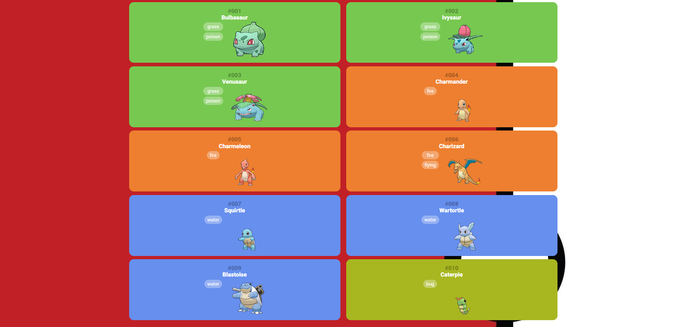

# Pokedex-App
 
# 📖 Projeto Pokédex  

Bem-vindo ao **Pokédex**, um projeto desenvolvido com o objetivo de explorar e consumir APIs de forma eficiente e divertida. Este projeto utiliza a API pública [PokéAPI](https://pokeapi.co/) para exibir os pokemons e suas classes em ordem.

## 🎯 Objetivo  
O projeto tem como foco o aprendizado e a prática no consumo de APIs RESTful, além de aplicar conceitos de desenvolvimento front-end e design responsivo, O intuito do projeto é requisitar os dados no servidor e traduzir o conteudo recebido no formato apropriado do meu codigo.  

## 👏 Creditos 
Gostaria de agradecer a outro aluno da DIO que disponibilizou o arquivo com os modelos 3D, eu perdi o link de acesso ao repositorio dele então não lembro seu nome, mas meus sinceros agradecimentos.

## 🛠️ Tecnologias Utilizadas  
- **HTML5**: Estrutura do projeto.  
- **CSS3**: Estilização responsiva e design atrativo.  
- **Normalize.css**: Garantia de consistência no estilo entre diferentes navegadores.  
- **JavaScript (ES6+)**: Lógica de consumo da API e manipulação dinâmica do DOM.  
- **PokéAPI**: Fonte de dados com informações sobre os Pokémon.  

## 🚀 Funcionalidades  
- Visualizar uma lista de Pokémon com seus nomes e imagens.  (Atualmente a lista consta com 300 pokemons diferentes, porém na pasta Assets/ tem mais 400 pokemons para serem ajustados em futuros commits.)
- Modelos 3d dos pokemons em formato GIF.
- Paginação para navegar entre diferentes grupos de Pokémon.  
- Exibir detalhes específicos de cada Pokémon, como tipos e habilidades.  
- Design responsivo para dispositivos móveis e desktops.

##  👀 Visão do projeto.



## 🌐 Como Usar  
1. Clone este repositório:  
```bash  
git clone https://github.com/seu-usuario/pokedex.git
```  
2. Navegue até o diretório do projeto:

```bash
cd pokedex
```
3. Abra o arquivo index.html no navegador.

## 🔧 Melhorias Futuras
- Implementar barra de pesquisa para buscar Pokémon pelo nome.
- Adicionar filtros para tipos específicos de Pokémon (ex.: Água, Fogo).
- Suporte a múltiplos idiomas.
- Exibição de gráficos com atributos dos Pokémon.
- 🎉 Contribuições
- Contribuições são bem-vindas! Sinta-se à vontade para abrir uma issue ou enviar um pull request.

## 🏆 Aprendizados
Este projeto ajudou no aprimoramento de habilidades como:

- Consumo de APIs com fetch.
- Manipulação de dados dinâmicos no DOM.
- Organização de projetos front-end.

## 📜 Licença
Este projeto está sob a licença MIT.

Feito com ❤️ por Vicente Davi Diniz
   
